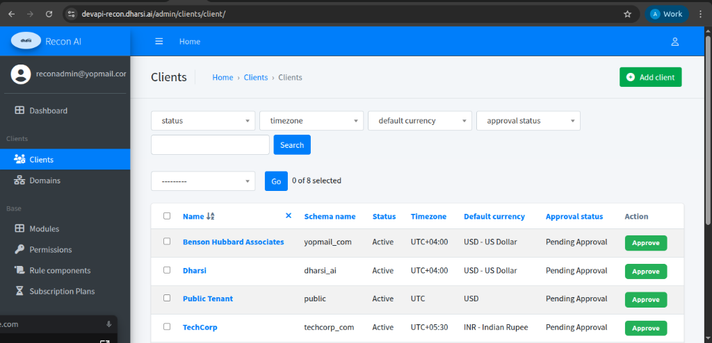
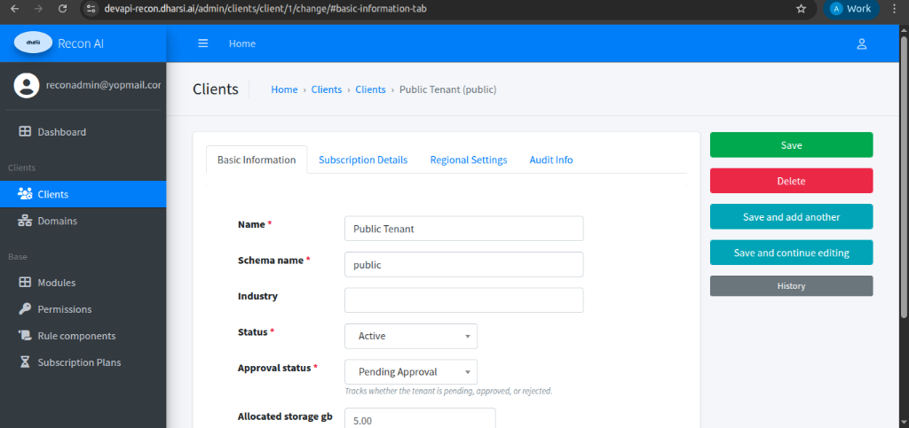
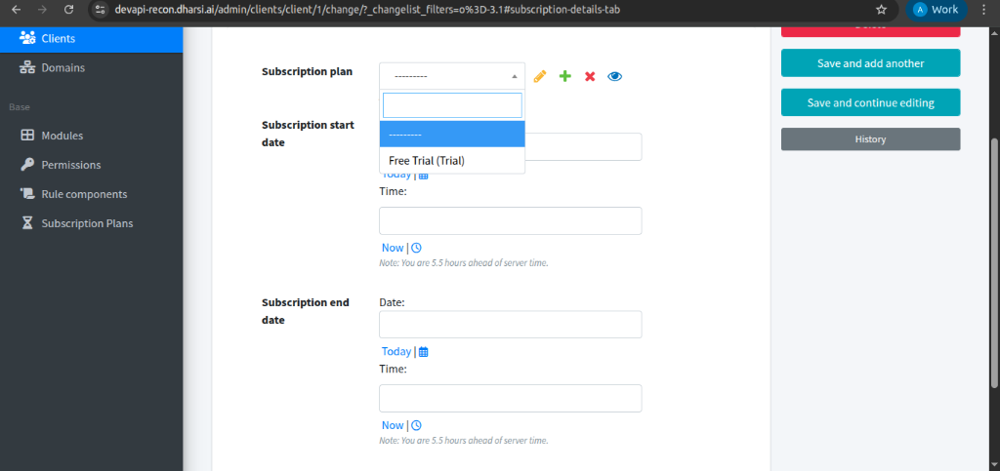
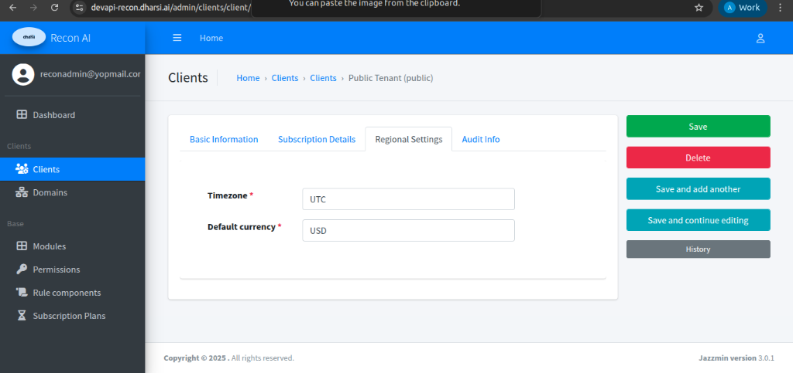
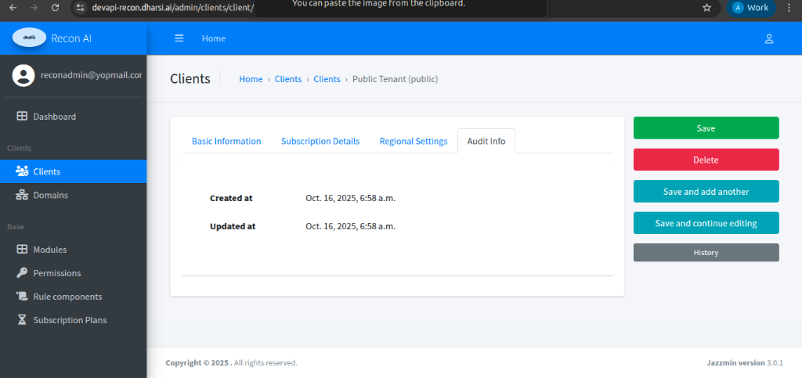

# Clients

### Description
Clients represent organizations or tenants using the Recon AI platform.
Whenever a new client registers, it is automatically listed in the Clients table and requires approval by a superuser before becoming fully operational.

---

### Client Registration, Approval & Rejection Flow

1. A client completes registration on the Recon AI platform.
2. An email notification is sent to the Super User at **support@dharsi.ai**.
3. The client appears in the **Clients table** with:
   - Approval Status: `Pending Approval`
4. A Super User reviews the client details.
5. The Super User clicks the **Approve** action.
6. A confirmation popup appears with options to:
   - Approve the client
   - Reject the client (with reason)
7. Based on the action taken:
   - The client status is updated
   - An automated email notification is sent to the client

---

#### Clients Listing Page

**Navigation**

Admin Panel → Clients → Clients

**Purpose**
- View all registered clients
- Filter and search client records
- Approve or reject pending clients
- Access detailed client configuration

---

#### Clients Table Fields

| Field | Description |
|------|------------|
| Name | Client or tenant name |
| Schema Name | Database schema associated with the client |
| Status | Operational state of the client |
| Timezone | Default timezone for the client |
| Default Currency | Primary currency used by the client |
| Approval Status | Pending Approval / Approved / Rejected |
| Action | Approve button for pending clients |

---

#### Filters & Search

Superusers can filter and search clients using:
- Status
- Timezone
- Default Currency
- Approval Status
- Keyword search

This helps efficiently manage large numbers of tenants.

---

### Client Approval & Rejection

#### Approve Action
- Clicking **Approve** opens a confirmation popup.
- On confirmation:
  - Client approval status changes to `Approved`
  - The client becomes eligible for subscription and full access
  - An **approval email** is automatically sent to the client

#### Reject Action
- Selecting **Reject** prompts the Super User to provide a **reason for rejection**.
- On rejection:
  - Client approval status changes to `Rejected`
  - The client remains inactive
  - A **rejection email** with the provided reason is sent to the client

This ensures transparency and proper communication with the client.

---

#### Client Detail View

Clicking on a client opens the **Client Detail Page**, where the superuser can view and manage all client-specific settings.

**Navigation**

Admin Panel → Clients → Clients → [Client Name]

---

### Client Detail Tabs

The Client Detail page is divided into multiple tabs for clarity and ease of management.

---

#### 1. Basic Information

**Purpose**  
Defines the core identity and operational state of the client.

**Fields**
- Client Name
- Schema Name
- Industry
- Status (Active / Inactive)
- Approval Status
- Allocated Storage (GB)

**Available Actions**
- Save
- Save and continue editing
- Save and add another
- Delete
- View change history

---

#### 2. Subscription Details

**Purpose**  
Used to assign and manage the client’s subscription plan.

**Includes**
- Subscription Plan selection (e.g., Free Trial, Paid Plans)
- Subscription Start Date and Time
- Subscription End Date and Time

**Behavior**
- Determines which modules and features the client can access
- Enforces plan validity and expiration
- Subscription changes take effect based on configured dates

---

#### 3. Regional Settings

**Purpose**  
Defines regional and localization preferences for the client.

**Fields**
- Timezone
- Default Currency

These settings affect:
- Data processing
- Reporting
- Reconciliation timelines
- Financial calculations

---

#### 4. Audit Info

**Purpose**  
Provides auditability and traceability for client-related changes.

**Displays**
- Created At timestamp
- Last Updated At timestamp

Audit information ensures compliance, governance, and accountability.

---
