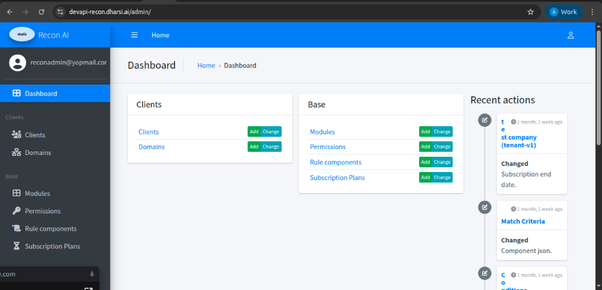

# Dashboard

The **Dashboard** serves as the command center for the Super Admin. It is designed to provide "at-a-glance" visibility into the health and status of the Recon AI platform.

## Dashboard Overview

Upon logging in, administrators are greeted with the Dashboard, which is strictly organized into clean functional areas to maximize efficiency.

### Visual Layout

The interface is divided into three primary zones:

1.  **Sidebar (Left)**
    - Dark gray background.
    - Contains the primary navigation menu.
    - Shows the active user (email) and organization logo (`dharisi Recon AI`).

2.  **Operations Center (Middle)**
    - Contains grouped "Cards" for quick access to core entities.
    - **Clients Card:** Quick links to `Clients` and `Domains`.
    - **Base Card:** Quick links to `Modules`, `Permissions`, `Rule components`, and `Subscription Plans`.
    - **Action Buttons:**
        - Add : Green button to immediately create a new record.
        - Change : Blue button to go to the list/edit view.

3.  **Recent Actions Timeline (Right)**
    - A vertical timeline feed on the right side of the screen.
    - Displays a chronological history of administrative actions.

---

### Breadcrumb Navigation
Located at the top of the content area (e.g., `Home › Dashboard`), this helps you track your location within the site hierarchy.
