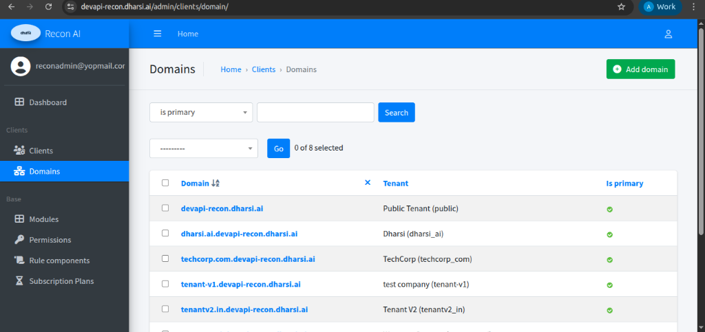
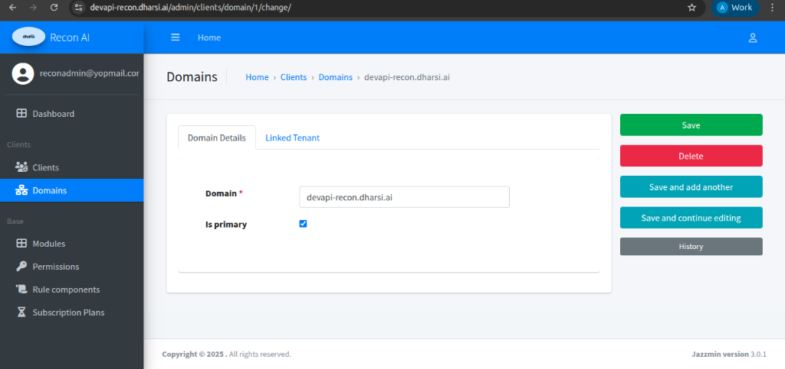
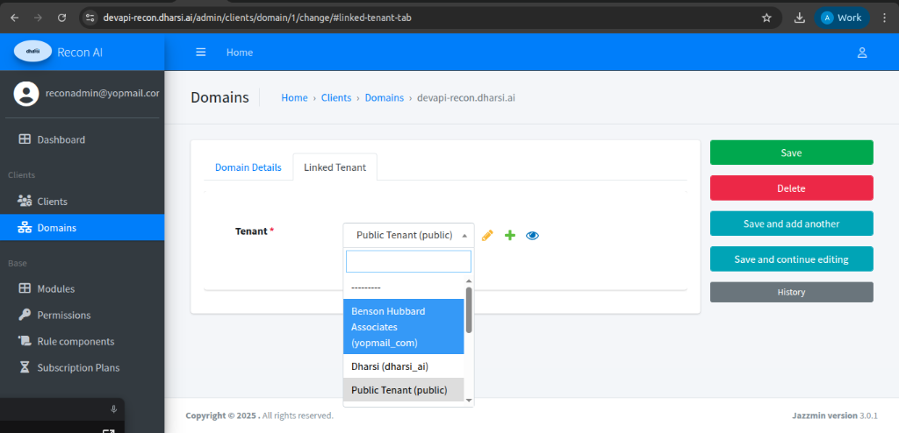

# Domains

### Description
Domains define the logical hostnames or URLs mapped to specific tenants. They allow the Recon AI platform to identify which client environment to load based on the URL being accessed.

---

### Domains Listing Page

**Navigation**  
Admin Panel → Clients → Domains

**Purpose**  
- View all registered hostnames and their associated tenants.
- Identify primary domains for multi-domain clients.
- Perform bulk actions (e.g., deleting multiple domain records).

#### Domains Table Fields
| Field | Description |
|------|------------|
| **Domain** | The specific hostname/URL (e.g., `tenant-v1.devapi-recon.dharsi.ai`). |
| **Tenant** | The Client Name and its corresponding Schema Name in parentheses. |
| **Is primary** | A visual indicator (green checkmark) signifying if this is the main domain for the tenant. |

#### Filters & Search
- **Search:** A dedicated search bar to find domains by hostname.
- **Is primary Filter:** A dropdown menu to filter the list by "Primary" or "Non-Primary" status.
- **Add Domain:** A green action button to register a new hostname.

---

### Domain Detail View

Clicking on a specific domain hostname opens the **Change Domain** interface. This view uses a tabbed layout to separate configuration.

**Navigation**  
Admin Panel → Clients → Domains → [Domain Name]

---

### Domain Tabs

#### 1. Domain Details
**Purpose**  
Defines the hostname and its priority.

**Fields**
- **Domain (Required):** The full hostname string. This field is mandatory (marked with a red asterisk).
- **Is primary:** A checkbox. When selected, this domain is treated as the primary entry point for the associated tenant.

#### 2. Linked Tenant
**Purpose**  
Used to associate the domain with a specific registered Client/Tenant in the system.

---

### Available Actions (Right Sidebar)
The following actions are available when adding or editing a domain:
- **Save:** Commits changes and returns to the domain list.
- **Delete:** Removes the domain entry from the system.
- **Save and add another:** Saves the current domain and opens a fresh "Add Domain" form.
- **Save and continue editing:** Saves changes and keeps the current page open.
- **History:** Opens an audit log showing which admin users modified the domain and when.
---
