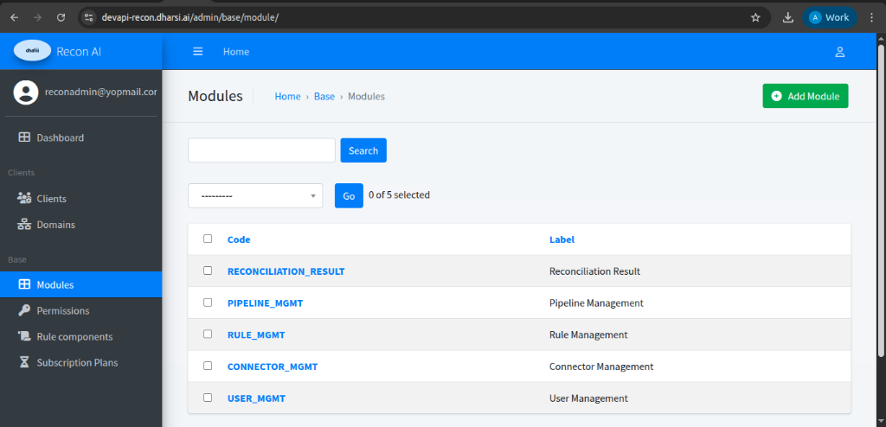
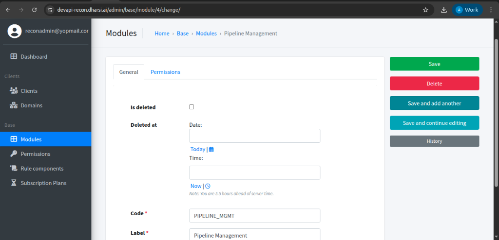

# Modules

### Description
Modules represent functional capabilities of the platform. They are used as a group of permissions for respective applications in Recon AI.

### Examples
- **Data Ingestion**
- **Reconciliation Engine**
- **Risk & Anomaly Detection**
- **Reporting & Analytics**

### Usage
- Enable or disable per client

