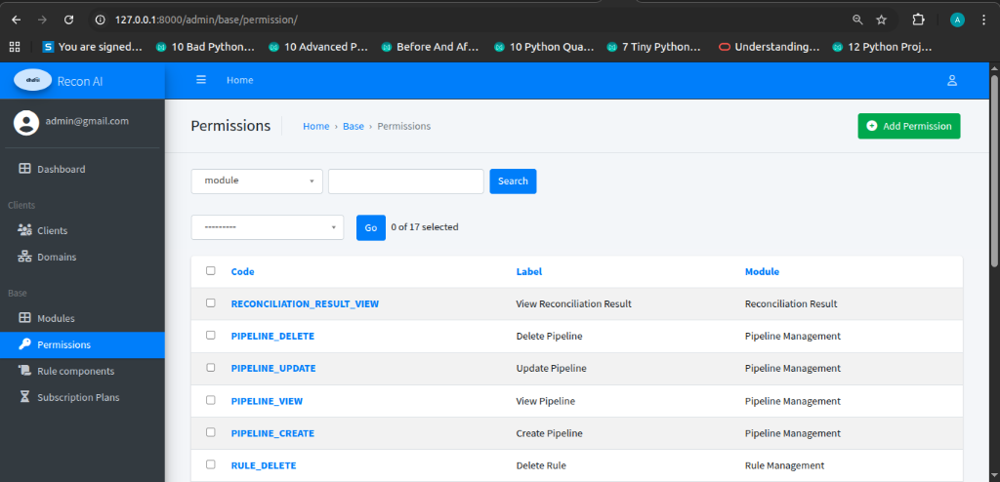
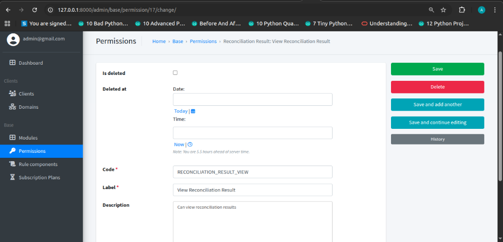

# Permissions

### Description
Permissions control user and role access across the platform. They allow specific actions (read, write, update, delete) to be granularly assigned to modules.

### Key Concepts
- **Role-based permissions**
- **Module-level access**
- **Action-based control**

---

### Permissions Listing Page

**Navigation**  
Admin Panel → Base → Permissions

**Purpose**  
- View all defined permissions in the system.
- Search for specific permissions by module or code.

#### Permissions Table Fields
| Field | Description |
|------|------------|
| **Code** | The unique identifier for the permission (e.g., `RECONCILIATION_RESULT_VIEW`). |
| **Label** | A human-readable name for the permission. |
| **Module** | The module this permission belongs to (e.g., `Reconciliation Result`, `Pipeline Management`). |

---

### Permission Detail View

**Navigation**  
Admin Panel → Base → Permissions → [Permission Name]

**Purpose**  
- View and edit the details of a specific permission.

#### Attributes
- **Code**: The system identifier for the permission (Required).
- **Label**: The display name for the permission (Required).
- **Description**: A brief explanation of what the permission allows (e.g., "Can view reconciliation results").
