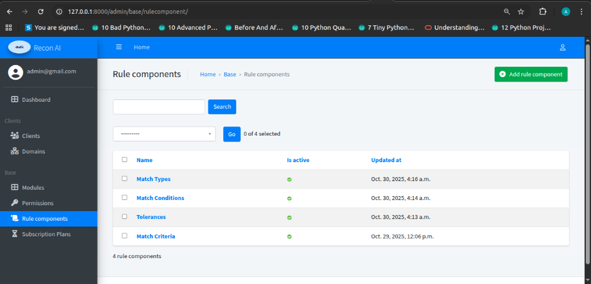
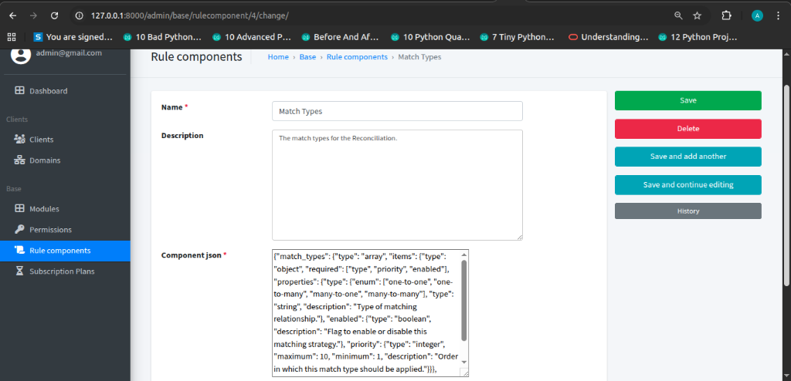

# Rule Components

### Description
Reusable components used to define reconciliation and matching logic. These components are the building blocks for creating flexible and complex reconciliation rules.

### Examples
- **Match Types**: Defines relationships (e.g., One-to-One, Many-to-Many).
- **Match Conditions**: Logical conditions for matching.
- **Tolerances**: Allowable differences in matching (e.g., amount or date variance).
- **Match Criteria**: Specific fields or attributes to match on.

---

### Rule Components Listing Page

**Navigation**  
Admin Panel → Base → Rule Components

**Purpose**  
- View all available rule components.
- Manage existing components (edit, delete).
- Create new rule components.

#### Table Fields
- **Name**: The name of the rule component (e.g., Match Types).
- **Is active**: Status indicator (green checkmark for active).
- **Updated at**: Timestamp of the last modification.

---

### Rule Component Detail View

**Navigation**  
Admin Panel → Base → Rule Components → [Component Name]

**Purpose**  
- Configure the specific logic and schema for a rule component using the JSON editor.

#### Fields
- **Name**: The display name of the component.
- **Description**: textual description of what the component does.
- **Component JSON**: The core configuration field. This JSON object defines the properties, types, and logic for the component (e.g., defining "one-to-one" or "many-to-many" options for a Match Type).
- **Is active**: Checkbox to enable or disable the component.
