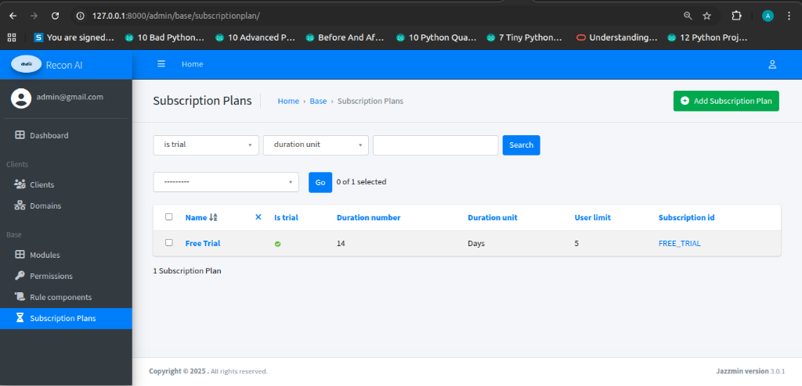
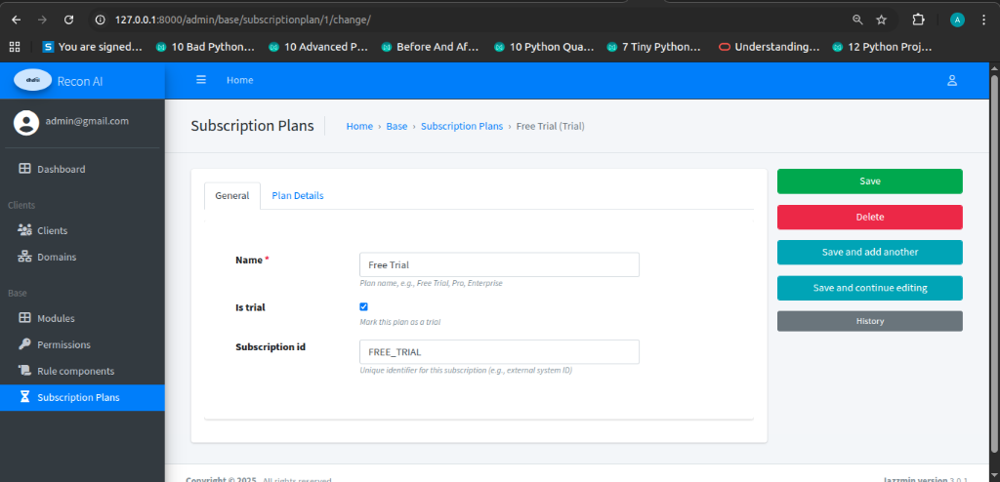
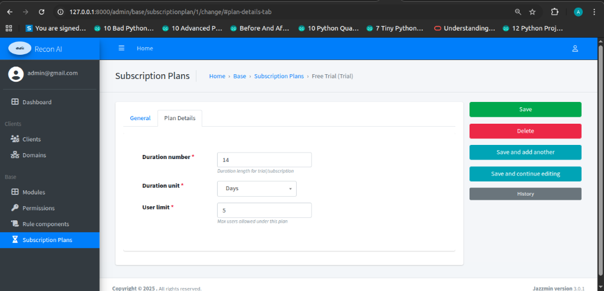

# Subscription Plans

### Description
Subscription plans define feature access and usage limits for clients. They allow you to tier your service offerings (e.g., Free Trial, Pro, Enterprise) and control resource consumption.

---

### Subscription Plans Listing Page

**Navigation**  
Admin Panel → Base → Subscription Plans

**Purpose**  
- View all available subscription plans.
- Check the status/terms of each plan (Trial status, Duration, User limits).
- Create or modify plans.

#### Table Fields
- **Name**: The display name of the plan (e.g., "Free Trial").
- **Is trial**: Indicates if this is a trial plan (Green checkmark = Yes).
- **Duration number**: The numeric value for the plan's validity (e.g., 14).
- **Duration unit**: The unit of time for the duration (e.g., Days, Months).
- **User limit**: The maximum number of users allowed under this plan.
- **Subscription id**: Unique identifier for the plan in the system.

---

### Subscription Plan Detail View

**Navigation**  
Admin Panel → Base → Subscription Plans → [Plan Name]

**Purpose**  
- Configure the specific terms, limits, and identifiers for a subscription plan.

#### 1. General
Basic identity configuration for the plan.

- **Name**: The plan name shown to users.
- **Is trial**: Checkbox to mark this as a trial plan.
- **Subscription id**: A unique system ID (e.g., `FREE_TRIAL`).

#### 2. Plan Details
Configuration of limits and validity periods.

- **Duration number**: Length of time the plan is valid.
- **Duration unit**: Time unit (Days, Weeks, Months, Years).
- **User limit**: Maximum number of user accounts permitted for a client on this plan.
