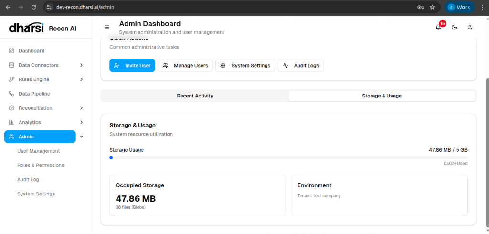

# Admin Dashboard

The **Admin Dashboard** provides a centralized view for system administration and user management tasks. It is accessible only to users with administrative privileges.

## Overview Metrics

The top panel displays critical system statistics:

*   **Total Users**: The number of registered users in the organization.
*   **Active Users**: The count of users currently active.
*   **Total Connectors**: The number of configured data sources.
*   **System Status**: A real-time health indicator of the backend services.

## Quick Actions

Common administrative tasks are accessible via one-click buttons:

*   **Invite User**: Add new team members to the organization.
*   **Manage Users**: View and edit existing user accounts.
*   **System Settings**: Configure global parameters.
*   **Audit Logs**: Review system activity logs.

## Storage & Usage

Monitor the system's resource utilization to ensure optimal performance.

*   **Storage Usage**: A visual progress bar showing the amount of storage consumed against the allocated quota.
*   **Occupied Storage**: The exact amount of data currently stored (e.g., *47.86 MB*).
*   **Environment**: Details about the current tenant or environment (e.g., *test company*).
