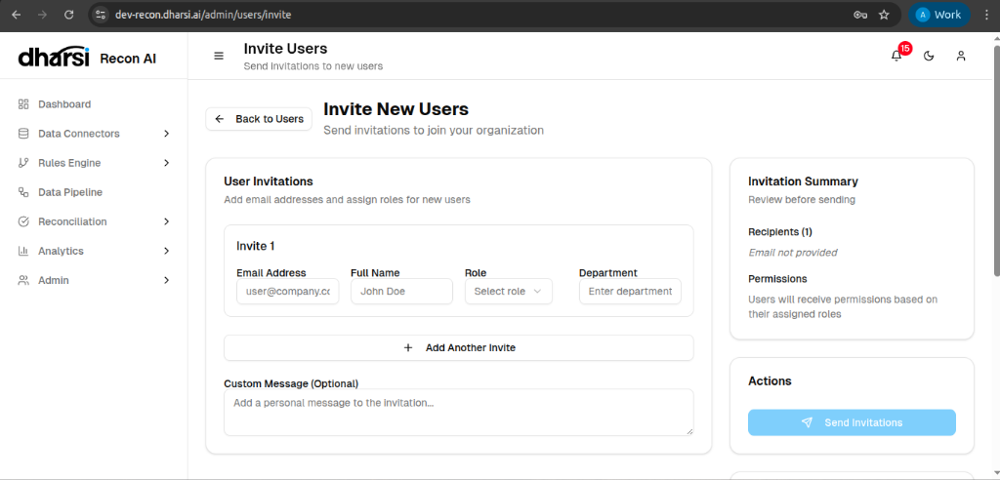

# User Management

The **User Management** section allows administrators to control access to the Recon AI platform. You can invite new users, assign roles, and manage permissions.

## User List

The main view displays all users associated with your organization.

*   **Search & Filter**: Find users by name or status.
*   **User Details**: View Name, Email, Department, and assigned Roles.
*   **Status**: Indicates if a user is *active* or *inactive*.
*   **Actions**: Edit user details or remove them from the system.

## Inviting Users

To add a new member to your team, use the **Invite User** workflow.

1.  Click the **Invite User** button on the User Management page.
2.  You will be directed to the invitation form.

### Invitation Form
*   **Email Address**: The recipient's email.
*   **Full Name**: The user's name.
*   **Role**: Assign a pre-defined role (e.g., *Admin*, *Reviewer*) to determine their permissions.
*   **Department**: (Optional) Specify the user's department.
*   **Custom Message**: Add a personal note to the invitation email.

Once you click **Send Invitations**, the user will receive an email with a link to join the organization. Upon acceptance and completion of their profile setup, they will be given access according to the assigned role.
