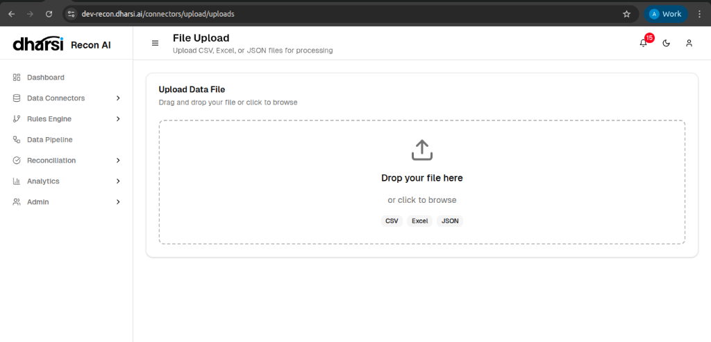
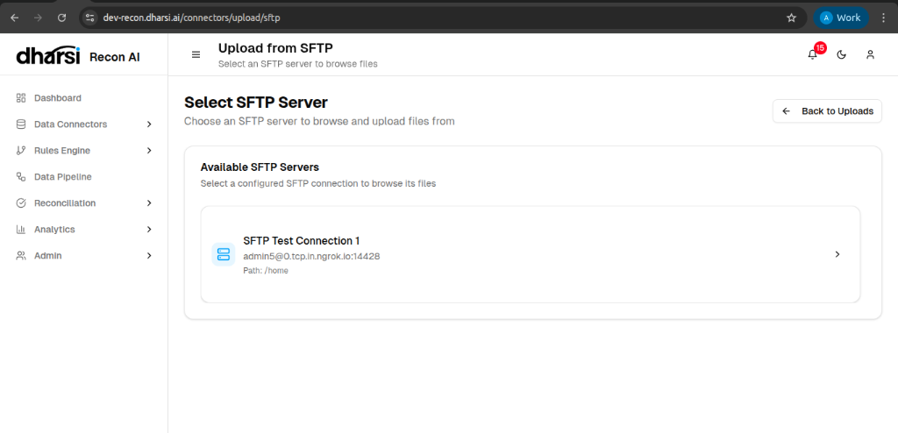
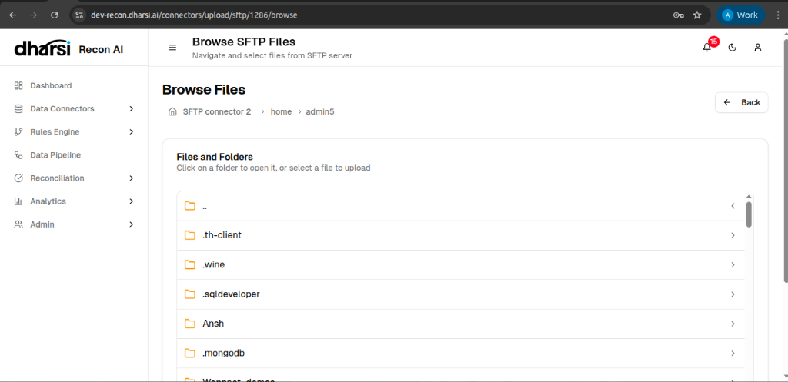

# File Upload

The **File Upload** interface is the central location for managing all file-based data imports, including CSV, Excel, and JSON files.

## Overview
This page displays a history of all uploaded files along with their processing status.

*   **File Name**: The name of the imported document.
*   **Uploaded At**: Timestamp of when the file was processed.
*   **Source**: The origin of the file (e.g., User upload).
*   **File Type**: The format of the data (csv, json, etc.).
*   **Mapping Status**: Indicates if the file columns have been mapped to the system schema (e.g., *Mapped*).

## Actions
Users can perform specific actions on each record:

*   **Edit**: Modify mapping or file details.
*   **Download**: Retrieve the original file.
*   **Delete**: Remove the file from the system (if permitted).

You can also initiate new uploads using the buttons at the top right:

### Upload File
Clicking **Upload File** opens the local upload interface. Here, you can drag and drop your file or browse your system to select a CSV, Excel, or JSON file for immediate processing.

### Upload from SFTP
Clicking **Upload from SFTP** redirects you to the server selection page. You must first choose a configured SFTP server to browse and select files residing on the remote system.

#### Browsing Files
Once you select a connector, you will be taken to the **Browse SFTP Files** interface.

*   **Navigate**: Click on folders to explore the directory structure of the remote server.
*   **Select**: Choose the specific file you wish to import.
*   **Map**: After selecting a file, you can proceed to the mapping stage to define how the file's columns relate to your schema.

