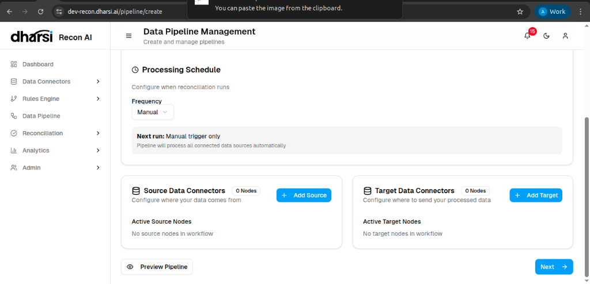
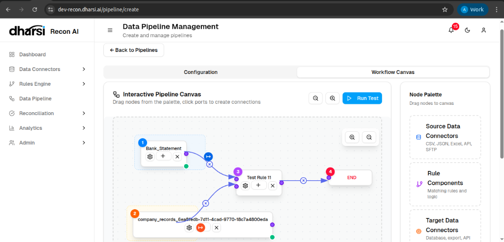

# Creating a Pipeline

Building a data pipeline involves configuring the basic parameters and then visually designing the data flow.

## Step 1: Configuration

### Basic Information
Set the identity and schedule for the pipeline.

*   **Pipeline Name**: A descriptive name for the workflow.
*   **Processing Schedule**: Define when the pipeline runs (e.g., *Manual* or scheduled frequency).

### Connectors
Define the inputs and outputs for your data.

*   **Source Data Connectors**: Select where data comes from (e.g., specific files or API endpoints).
*   **Target Data Connectors**: Select where processed data should be sent (optional).

## Step 2: Workflow Canvas

After configuration, you enter the **Interactive Pipeline Canvas**, where you define the logic flow.

### Building the Workflow
1.  **Node Palette**: On the right, you have access to available components (Source Connectors, Rules, Target Connectors).
2.  **Drag and Drop**: Pull nodes onto the canvas to represent steps in your process.
3.  **Connect Nodes**: Draw lines between the ports of different nodes to define the data path.
    *   Connect **Source Data** -> **Rule Components** for reconciliation.
    *   Connect **Rule Components** -> **Target Data** (if applicable).
4.  **Run Test**: Verify the logic before activating.
