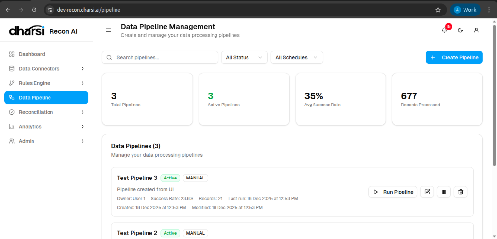

# Data Pipeline Management

Data Pipelines automate the flow of information between your connectors and the reconciliation engine. This dashboard provides a centralized view of all processing workflows.

## Dashboard Metrics
*   **Total Pipelines**: The number of configured workflows.
*   **Active Pipelines**: The number of workflows currently enabled.
*   **Avg Success Rate**: The historical reliability of your data processing.
*   **Records Processed**: The volume of data handled by the pipelines.

## Managing Pipelines
The list view allows you to control each pipeline:

*   **Run Pipeline**: Manually trigger an immediate execution.
*   **Edit/Pause/Delete**: Manage the configuration and state of the workflow.
*   **History**: View logs of previous executions.
