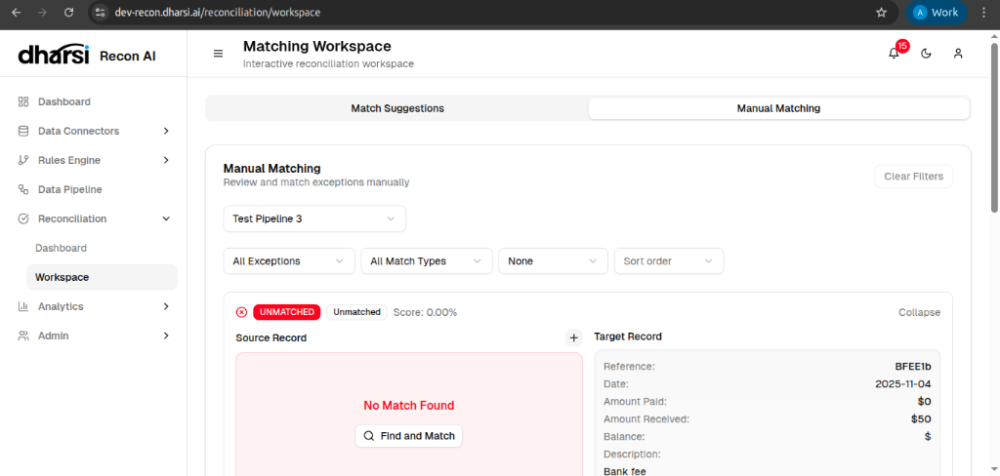

# Matching Workspace

The **Matching Workspace** is an interactive environment for resolving exceptions and fine-tuning your data reconciliation. It allows human review of complex cases that the automated rules could not resolve with certainty.

## Manual Matching
The Manual Matching interface gives you full control over the reconciliation of specific records.

### Workflow
1.  **Filter**: Use the controls at the top to select specific pipelines, exception types, or match categories.
2.  **Review**: Examine the *Source Record* and *Target Record* side-by-side.
    *   **Unmatched**: The system found no suitable candidate.
    *   **Partial**: A potential match was found but fell outside strictly defined tolerances.
3.  **Action**:
    *   **Find and Match**: Search for the correct counterparty record manually.
    *   **Approve/Reject**: For partial matches, validate if the system's suggestion is correct.

## Match Suggestions
(Under Development)
This section presents AI-driven proposals for matches, allowing users to bulk-approve high-probability pairings to speed up the review process.
