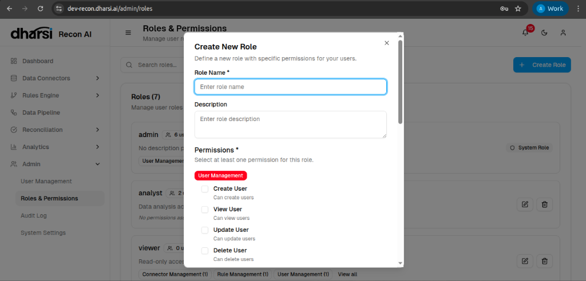

# Roles & Permissions

Recon AI employs a Role-Based Access Control (RBAC) system, allowing administrators to define precise access levels for different users. The **Roles & Permissions** section is where you manage these definitions.

## Roles List

This view displays all available roles within your organization.

*   **System Roles**: Pre-defined roles (e.g., *admin*) that cannot be deleted but may have editable permissions.
*   **Custom Roles**: User-defined roles created to match specific organizational needs (e.g., *analyst*, *viewer*).
*   **Summary**: Quickly view the number of users assigned to a role and the count of enabled permissions.

## Creating & Editing Roles

You can create new roles or modify existing ones to tailor access rights.

1.  Click **Create Role** (or the **Edit** icon for an existing role).
2.  Define the role's identity and scope.

### Role Details
*   **Role Name**: A unique name for the role.
*   **Description**: A brief explanation of the role's function.

### Permissions
Permissions are grouped by module (e.g., *User Management*, *Connector Management*).

*   **Select Permissions**: Check the boxes for specific actions you want to grant (e.g., *Create User*, *View User*, *Update User*, *Delete User*).
*   **Grant Access**: Once saved, users assigned this role will immediately inherit these permissions.
