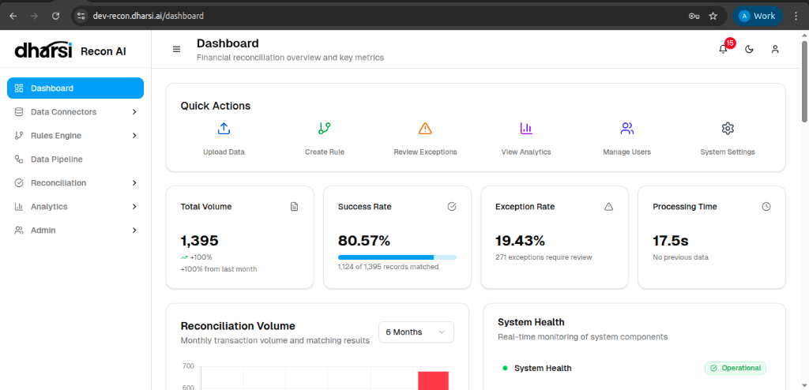

# Dashboard

The **Dashboard** serves as the central hub of Recon AI, providing a real-time overview of your financial reconciliation status.

It is designed to give you immediate insights into key metrics, quick access to common tasks, and visibility into the system's operational health.

## Overview
The page is organized into intuitive sections:
- **Header**: Displays the page title and a brief description.
- **Quick Actions**: A row of shortcuts for frequently performed tasks.
- **Key Metrics**: A set of cards highlighting critical statistics like Total Volume, Success Rate, and Exception Rate.
- **Reconciliation Volume**: A chart visualizing transaction trends over time.
- **System Health**: A status monitor for system components.

## Quick Actions
The **Quick Actions** panel provides one-click access to essential functions:

*   **Upload Data**: Navigate to the data import interface to upload new transaction files.
*   **Create Rule**: Quickly define new matching logic or reconciliation rules.
*   **Review Exceptions**: Jump directly to the list of unmatched or flagged records requiring manual intervention.
*   **View Analytics**: Access detailed reports and analytical dashboards.
*   **Manage Users**: (Admin only) Add or modify user accounts and permissions.
*   **System Settings**: Configure global application settings.

## Key Metrics
This section displays vital performance indicators for the current period:

*   **Total Volume**:
    *   Shows the total number of records processed (e.g., *1,395*).
    *   Includes a trend indicator (e.g., *+100% from last month*) to track growth.
*   **Success Rate**:
    *   The percentage of records successfully matched automatically (e.g., *80.57%*).
    *   Displays the count of matched records against the total (e.g., *1,124 of 1,395 records matched*).
    *   A progress bar provides a visual representation of the completion rate.
*   **Exception Rate**:
    *   The percentage of records that failed to match or triggered exceptions (e.g., *19.43%*).
    *   Indicates the number of items needing attention (e.g., *271 exceptions require review*).
*   **Processing Time**:
    *   The average time taken to process the batch (e.g., *17.5s*).

## Charts & Monitoring

### Reconciliation Volume
A graph displaying the monthly transaction volume and matching results over a selected period (default: **6 Months**). This helps in identifying trends in data influx and processing efficiency.

### System Health
A real-time monitor showing the status of system components.

*   **Status**: Displays *Operational* (Green) when systems are healthy.
*   **Indicators**: Provides visual confirmation that the backend services are running closely.

### User Activity Trends
A stacked bar chart visualizing weekly user activity, broken down by category:

*   **Connectors** (Green): Activities related to data connections.
*   **Rules** (Red): Creation or modification of reconciliation rules.
*   **Pipelines** (Yellow): Execution and management of data pipelines.

### Status Distribution
A donut chart providing an immediate visual breakdown of the current reconciliation status:

*   **Auto-Matched** (Green): Records successfully matched by the system.
*   **Manual Match** (Orange): Records matched manually by users.
*   **Exceptions** (Red): Unmatched records requiring attention.

## Recent Activity
A log displaying the latest system events and user actions, helping administrators track changes and operations in real-time.
