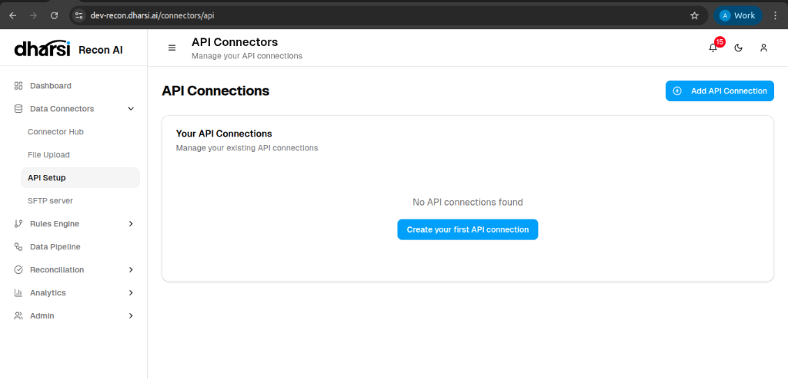

# API Setup

The **API Setup** page allows you to configure and manage direct integrations with external financial services and web applications.

## Managing Connections

*   **Add API Connection**: Use the button to configure a new endpoint.
*   **Status**: Monitor the health and connectivity of your active integrations.

*If no connections are configured, you will see a prompt to create your first API connection.*
