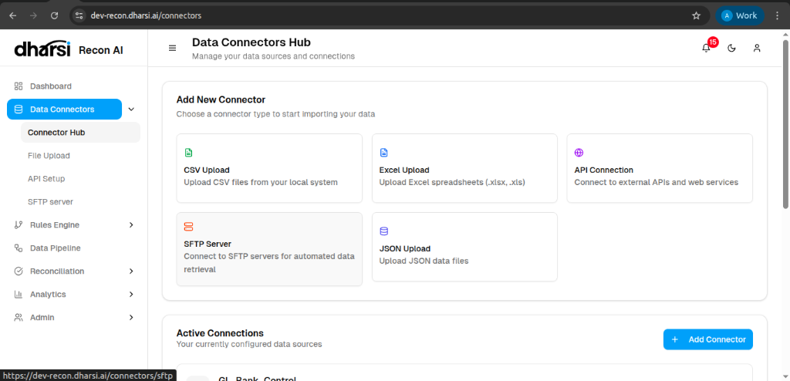

# Data Connectors Hub

The **Data Connectors Hub** is your starting point for importing transaction data into Recon AI. It supports various methods to ensure flexible integration with your existing financial systems.

## Available Connectors

*   **CSV Upload**: Import comma-separated value files manually.
*   **Excel Upload**: Support for `.xlsx` spreadsheet formats.
*   **JSON Upload**: Import structured JSON data files.
*   **API Connection**: Set up direct integration with external services for real-time data pulling.
*   **SFTP Server**: Configure secure file transfer protocol connections for automated batch processing.

> **Note**: Selecting **CSV Upload**, **Excel Upload**, or **JSON Upload** will direct you to the unified [File Upload](file-upload.md) interface to manage your files.
