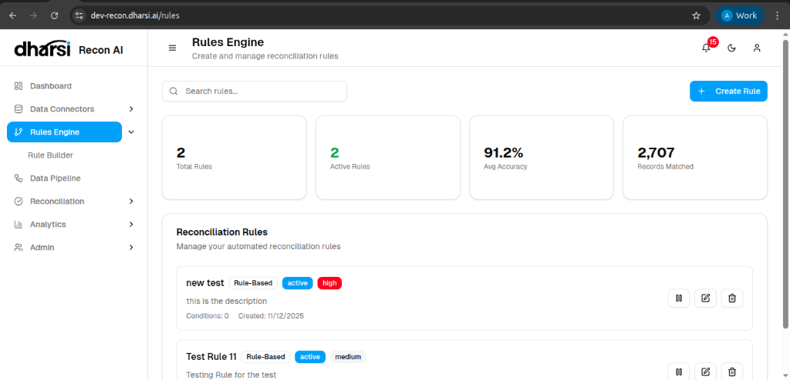

# Rules Engine Overview

The **Rules Engine** is the core intelligence of Recon AI, allowing you to define, manage, and monitor the logic used for automated data reconciliation.

## Dashboard Metrics
The top overview panel provides a snapshot of your rule performance:

*   **Total Rules**: The count of all rules defined in the system.
*   **Active Rules**: The number of rules currently enabled and processing data.
*   **Avg Accuracy**: The overall efficiency and precision of your matching logic.
*   **Records Matched**: The total number of successful matches generated by the engine.

## Managing Rules
The **Reconciliation Rules** list allows you to control individual rules:

*   **Status Indicators**: Quickly see if a rule is *active*, its validation level (e.g., *Rule-Based*), and its priority (*High*, *Medium*, *Low*).
*   **Actions**:
    *   **Pause/Resume**: Toggle the rule's activity status.
    *   **Edit**: Modify the rule's logic or configuration.
    *   **Delete**: Remove the rule from the system.
