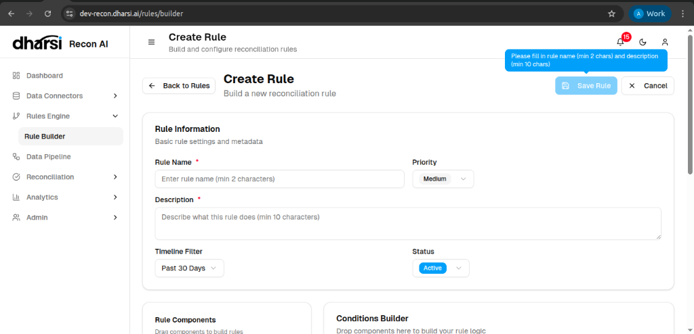

# Rule Builder

The **Rule Builder** provides a visual interface for constructing complex reconciliation logic without writing code.

## Step 1: Rule Information
First, define the metadata and scope of your rule.

*   **Rule Name**: unique identifier for the rule (min 2 chars).
*   **Description**: A detailed explanation of the rule's purpose (min 10 chars).
*   **Priority**: Set the execution precedence (*Medium* default).
*   **Timeline Filter**: Restrict the data scope (e.g., *Past 30 Days*).
*   **Status**: Set the initial state of the rule (*Active* or *Inactive*).

## Step 2: Logic Builder
After saving the basic info, you proceed to the drag-and-drop conditions builder.

### Components
*   **Match Types**: Define the strategy (e.g., *One-to-One*, *One-to-Many*).
*   **Tolerances**: Allow for minor variances in Date or Amount to improve match rates.
*   **Match Criteria**: Configure specific field-level matching logic.
*   **Conditions**: Set logical constraints.

To build a rule, simply drag a component from the left panel into the **Conditions Builder** canvas on the right.
